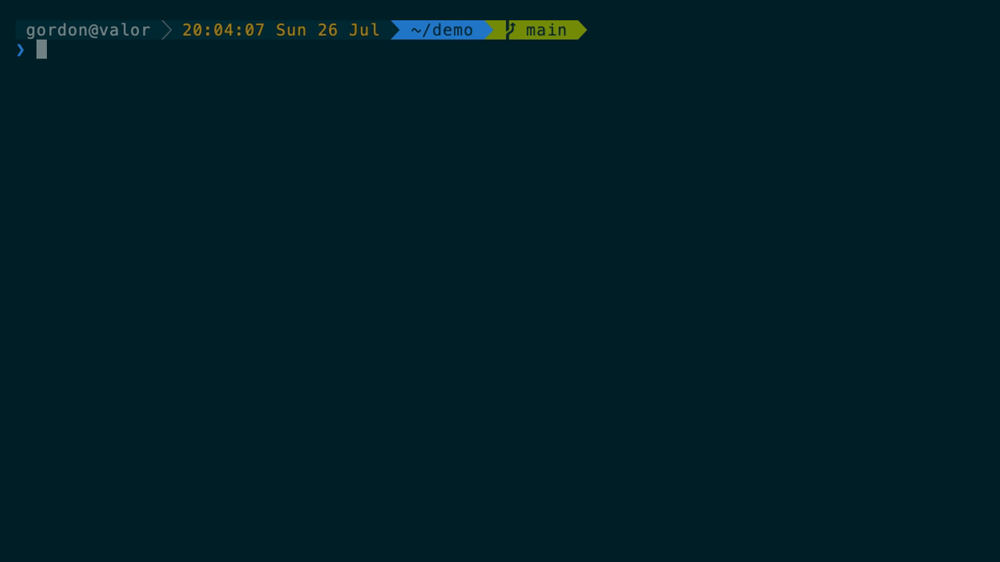

# promptconf

**A powerline prompt for zsh that you configure from the shell, not from a config file.**

One file. No framework, no dependencies, no restarts.



---

## Why

Most zsh prompts ask you to edit a file, start a new shell, squint, and repeat.
promptconf closes that loop: preview every colour scheme rendered with your own
directory and git state, switch with one command, rearrange segments and watch
the prompt move, then keep what you land on. Choices persist across sessions.

It is a single self-contained file. It does not need oh-my-zsh, and it does not
fight with it — every function and variable is namespaced, including the segment
functions, which is where collisions usually happen.

## Install

```sh
curl -fsSL https://raw.githubusercontent.com/gleete/promptconf/main/install.sh | zsh
```

Clones into `~/.promptconf` and adds one `source` line to your `.zshrc`. Safe to
run again — it updates in place and will not add the line twice. It also warns
if your `.zshrc` sets a `ZSH_THEME` that would compete for `PROMPT`.

`PROMPTCONF_HOME=~/elsewhere` changes where it installs.
`PROMPTCONF_NO_MODIFY_RC=1` installs without touching `.zshrc`.

<details>
<summary><b>Homebrew</b></summary>

```sh
brew tap gleete/promptconf https://github.com/gleete/promptconf
brew trust gleete/promptconf
brew install promptconf
```

```zsh
# ~/.zshrc
source /opt/homebrew/share/promptconf/promptconf.zsh
```

Intel macOS uses `/usr/local` instead. Hardcode whichever applies rather than
calling `brew --prefix` — it shells out to Ruby and would slow every shell start.

The URL is needed because this repo is not named `homebrew-promptconf`, and
`brew trust` because Homebrew 4.6+ refuses to load formulae from third-party
taps until you say so. `brew install --HEAD promptconf` tracks `main` instead of
the latest tag.
</details>

<details>
<summary><b>Git, by hand</b></summary>

It is one file, so there is nothing to build.

```sh
git clone https://github.com/gleete/promptconf ~/.promptconf
```

```zsh
# ~/.zshrc
source ~/.promptconf/promptconf.zsh
```
</details>

<details>
<summary><b>With oh-my-zsh</b> — keeps your plugins and aliases</summary>

The only rule is that nothing else may own `PROMPT`, so set `ZSH_THEME=""`.

**Sourced directly**, after `oh-my-zsh.sh`:

```zsh
ZSH_THEME=""
plugins=(git)
source $ZSH/oh-my-zsh.sh
source ~/.promptconf/promptconf.zsh
```

**As a theme** — the most idiomatic route, since a prompt is what a theme is:

```sh
ln -s ~/.promptconf/promptconf.zsh-theme $ZSH_CUSTOM/themes/promptconf.zsh-theme
```
```zsh
ZSH_THEME="promptconf"
```

The link is the `.zsh-theme` file, not the directory — oh-my-zsh sources
`$ZSH_CUSTOM/themes/$ZSH_THEME.zsh-theme` by name.

**As a plugin**, if you would rather manage it in the plugins array:

```sh
ln -s ~/.promptconf $ZSH_CUSTOM/plugins/promptconf
```
```zsh
ZSH_THEME=""
plugins=(git promptconf)
```

Here it is the directory, since oh-my-zsh looks for
`plugins/<name>/<name>.plugin.zsh`.

The theme and plugin files are three-line shims around the same
`promptconf.zsh`. Nothing about the tool changes between them.
</details>

Then `source ~/.zshrc` and run `promptconf wizard`.

## Requirements

**zsh 5.0+** and a **256-colour terminal**.

**A [Powerline-patched font](https://github.com/powerline/fonts)** for the ``
separator and `` branch glyph. Everything else is ordinary Unicode. If those
two render as boxes, the font is the reason.

**[Solarized Dark](https://ethanschoonover.com/solarized/)** is what the default
scheme is tuned against — [download it
here](https://github.com/altercation/solarized/archive/master.zip) and import
the preset for your terminal. It is not required: colours are keyed to ANSI
slots, so the prompt adapts to whatever palette you have loaded. But the
contrast ratios were chosen against Solarized Dark, so it is where the defaults
look their best.

`promptconf doctor` checks all of the above, and tells you if something else is
competing for `PROMPT`.

## Usage

`promptconf wizard` walks the whole thing in five steps and is the only command
you need to remember. Everything it does is available directly:

| | |
| --- | --- |
| `promptconf schemes` | preview every scheme, rendered |
| `promptconf schemes ember` | switch to one |
| `promptconf segments` | what each segment looks like |
| `promptconf layout` | which are on, in order |
| `promptconf add venv` | turn one on |
| `promptconf remove git` | turn one off |
| `promptconf move git first` | also `up` `down` `last` `<n>` `before <seg>` `after <seg>` |
| `promptconf keys` | every colour slot, with a swatch |
| `promptconf colors` | the 256-colour cube, to find a number |
| `promptconf set dir_bg 25` | change one slot live |
| `promptconf save mine` | keep the current colours as a scheme |
| `promptconf export mine` | print them as a scheme function, to share |
| `promptconf lines 1` | one-line prompt; `2` puts the cursor on its own line |
| `promptconf doctor` | check fonts, colour, `PROMPT` conflicts |

Everything is tab-completable, and segments take short names — `add venv`
resolves to `promptconf_venv`.

## Schemes

`agnoster` · `tonal` · `ember` · `ice` · `mono` · `vivid` · `light`

`agnoster` is the default, reproducing the classic theme's colours. `tonal`
drops the backgrounds and carries colour in the text alone, `mono` removes hue
entirely, and `light` is for a light terminal background. `promptconf schemes`
renders them all with your actual directory and git state.

## Segments

**On by default** — `status` `context` `time` `dir` `git`

**Available** — `venv` `node` `duration` `exit`

`promptconf segments` renders all of them with a description. Most hide
themselves unless something is wrong or present, so it fakes the conditions — a
failed command, an active virtualenv, a slow command — to make them visible.
It is also reachable as `?` inside the wizard.

`status` shows `✘` on a non-zero exit, `⚡` as root, `⚙` when jobs are running.

`duration` reports how long the last command took, staying hidden below
`PROMPTCONF_DURATION_MIN` seconds (default 3) so it never clutters ordinary use.
It scales its precision — `4.0s`, `12s`, `2m05s`, `1h20m` — because tenths stop
being interesting once something has run for an hour. Timing spans
`preexec`→`precmd`, so it measures wall clock, including time spent inside
interactive programs.

### git

Green when clean, amber when dirty. The branch shows as `` name, `➦ sha` when
detached, or `◈ tag` when detached on an exact tag.

Since the colour already says clean or dirty, file-state glyphs would only
repeat it — so only divergence shows by default: `⇡n` ahead, `⇣n` behind.

`PROMPTCONF_GIT_MARKS` controls the rest:

```zsh
PROMPTCONF_GIT_MARKS=()                                   # branch only
PROMPTCONF_GIT_MARKS=(staged unstaged)                    # what agnoster shows
PROMPTCONF_GIT_MARKS=(staged unstaged untracked conflict stashed ahead behind)
```

`✚` staged · `●` unstaged · `…` untracked · `✖` conflicts · `✭n` stashes

The whole segment costs a single `git status --porcelain=v2 --branch
--show-stash` — branch, divergence, stash count and file states from one fork,
so it stays fast in large repositories. Every glyph is overridable through
`PROMPTCONF_GLYPH`, and only the branch `` needs a Powerline font.

## How it works

`PROMPT` holds a command substitution, so zsh re-runs `promptconf_build` on
every redraw:

```zsh
PROMPT='%{%f%b%k%}$(promptconf_build)'$'\n''...❯ '
```

`promptconf_build` captures `$?` first — the only moment the last command's exit
status is still visible — then walks `PROMPTCONF_SEGMENTS`, calling each
function in turn. A segment is anything that calls:

```zsh
promptconf_segment <background> <foreground> <content>
```

and renders nothing by returning early, which is how `git` disappears outside a
repository.

`promptconf_segment` is what produces the powerline look. It remembers the
previous segment's background, and when the next differs it draws the ``
separator *in the old colour against the new*, which is what makes the arrow
read as a transition rather than a shape. When two neighbours share a
background it draws the thin `` instead — which also keeps columns aligned,
since both forms occupy the same width.

Colours never appear in the segments themselves. They read from the
`PROMPTCONF` map, which a scheme function fills. That indirection is the whole
design: switching scheme is one function call, and every segment follows.

State is a handful of files under `~/.config/promptconf` — the active scheme,
the segment order, whether the prompt is one line or two, and any schemes you
saved.

## One line or two

Two lines by default: segments on the first, the cursor on its own line below,
so a long path never crowds what you are typing. One line puts the marker
straight after the last segment.

```zsh
promptconf lines 1
promptconf lines 2
```

It is also step 4 of the wizard, which renders both so you can compare.

## Extending

<details>
<summary><b>Writing a segment</b></summary>

Any function that calls `promptconf_segment` works. Return early to render
nothing.

```zsh
promptconf_kube() {
  (( $+commands[kubectl] )) || return
  local ctx=$(kubectl config current-context 2>/dev/null) || return
  promptconf_segment 24 15 "⎈ ${ctx:gs/%/%%}"
}
promptconf_register promptconf_kube
promptconf add kube
```

Escape `%` in anything dynamic with `:gs/%/%%` or zsh reads it as a prompt
escape. Colours are names, `0`–`255`, or empty for the terminal default.
</details>

<details>
<summary><b>Writing a scheme</b></summary>

A scheme fills the `PROMPTCONF` map. Tune one live and run
`promptconf export <name>` — it prints exactly this shape:

```zsh
promptconf_scheme_mine() {
  PROMPTCONF=(
    status_bg 0   status_fg 14
    ctx_bg    0   ctx_fg    14
    time_bg   24  time_fg   214
    dir_bg    4   dir_fg    0
    clean_bg  2   clean_fg  8
    dirty_bg  3   dirty_fg  8
    err 1  root 3  job 6  mark 4
  )
}
```

`promptconf save <name>` writes it to `~/.config/promptconf/schemes/` and loads
it in every future shell. Optional segments fall back to a sensible tint, so a
scheme only names the slots it wants to override.
</details>

## Configuration

State lives in `$XDG_CONFIG_HOME/promptconf`, or `~/.config/promptconf`:

| path | holds |
| --- | --- |
| `scheme` | the active scheme name |
| `layout` | the active segment order |
| `lines` | one-line or two-line |
| `schemes/*.zsh` | schemes written by `promptconf save` |

| variable | does |
| --- | --- |
| `PROMPTCONF_DIR` | where that state lives |
| `PROMPTCONF_LINES` | `1` or `2` — whether the cursor gets its own line |
| `PROMPTCONF_MARKER` | the glyph before the cursor, `❯` by default |
| `PROMPTCONF_SEPARATOR` | glyph between segments of different colour |
| `PROMPTCONF_SEPARATOR_THIN` | hairline between segments sharing a colour, and what keeps columns aligned; `' '` gives the alignment without a glyph |
| `PROMPTCONF_GLYPH` | the git and branch glyphs |
| `PROMPTCONF_GIT_MARKS` | which git details appear |
| `PROMPTCONF_DURATION_MIN` | seconds before `duration` appears |
| `PROMPTCONF_COMPINIT` | `0` to stop promptconf running `compinit` |

### Colours

Two palettes back the schemes. `PROMPTCONF_SOL` maps solarized names onto ANSI
slots 0–15, so those follow whatever palette your terminal has loaded — change
terminal themes and the prompt follows. `PROMPTCONF_TINT` holds fixed
256-colour tones like `slate`, `gold` and `rust` for hues those sixteen slots
cannot reach; those stay put by design.

## Contributing

Schemes and segments are both small, and new ones are welcome. Tune a scheme
live, run `promptconf export <name>`, and paste what it prints — that is exactly
the shape the built-ins take. [CONTRIBUTING.md](CONTRIBUTING.md) has the
details, including the contrast floor and the zsh traps worth knowing.

The demo above is generated, not recorded — `vhs demo/demo.tape` rebuilds it.

## Licence

MIT
